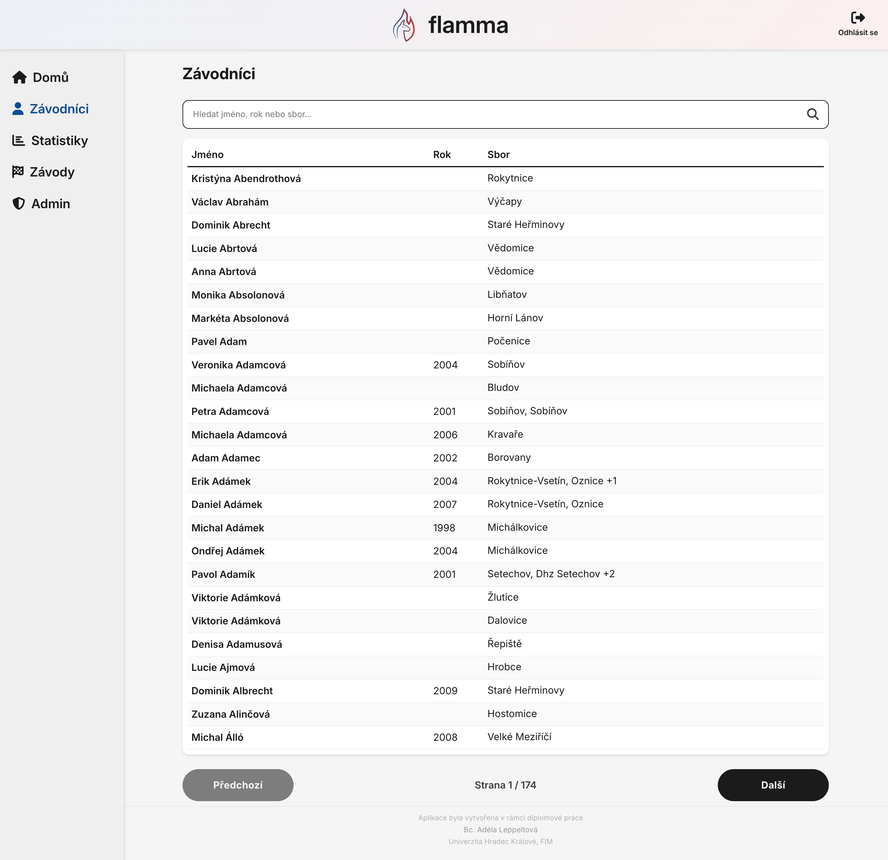
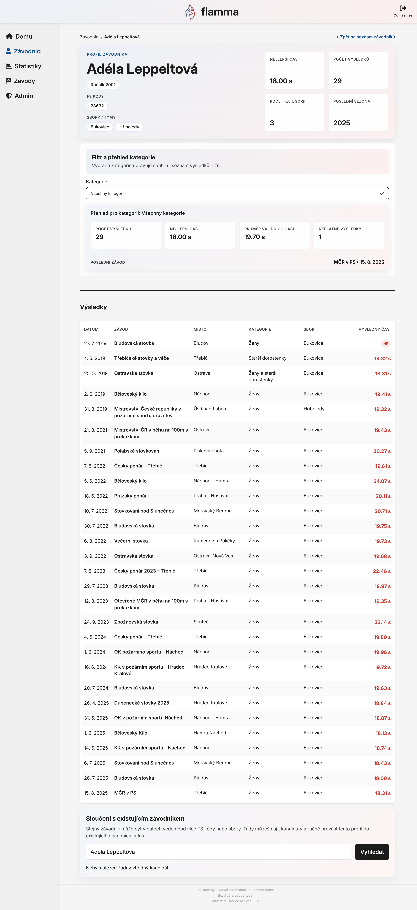
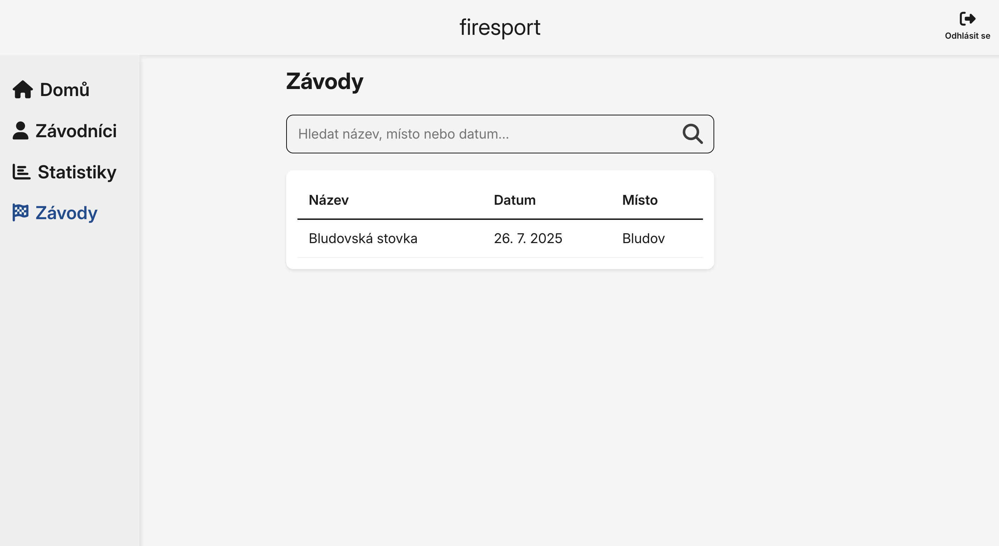
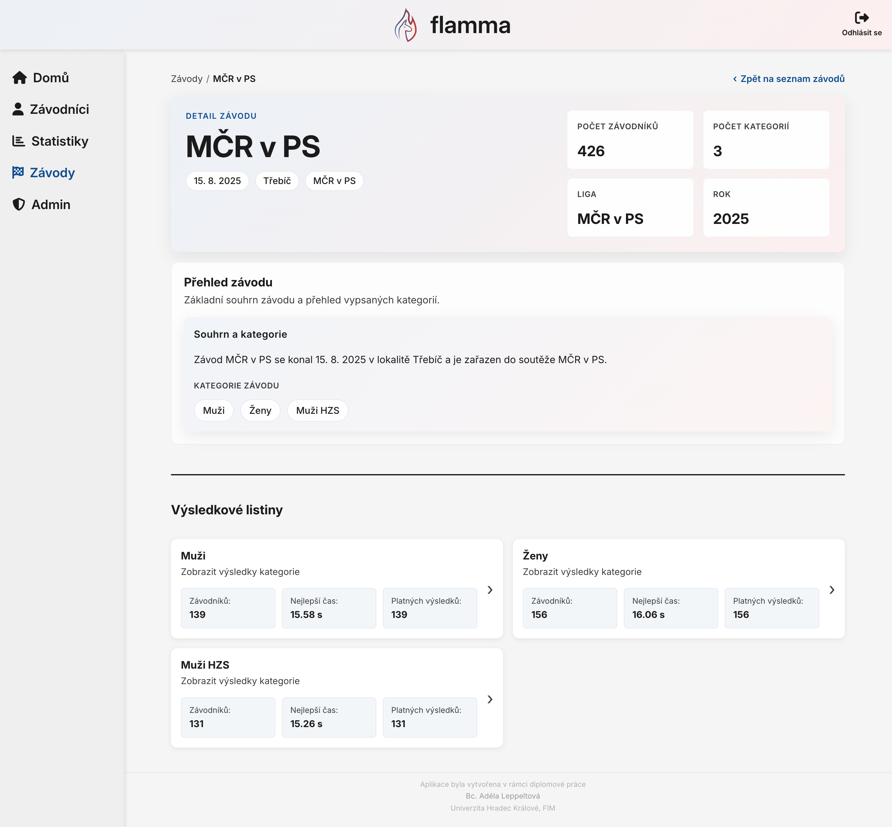
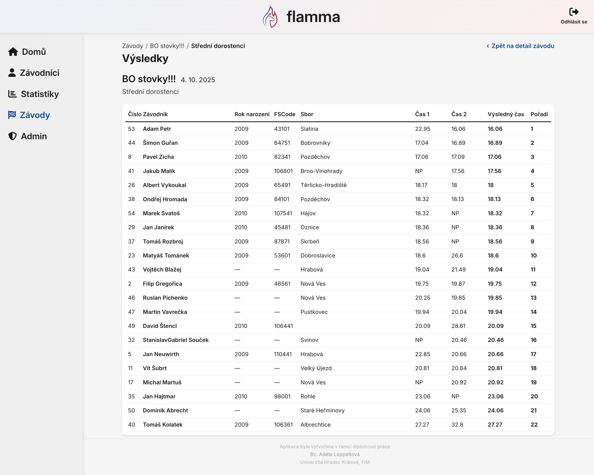
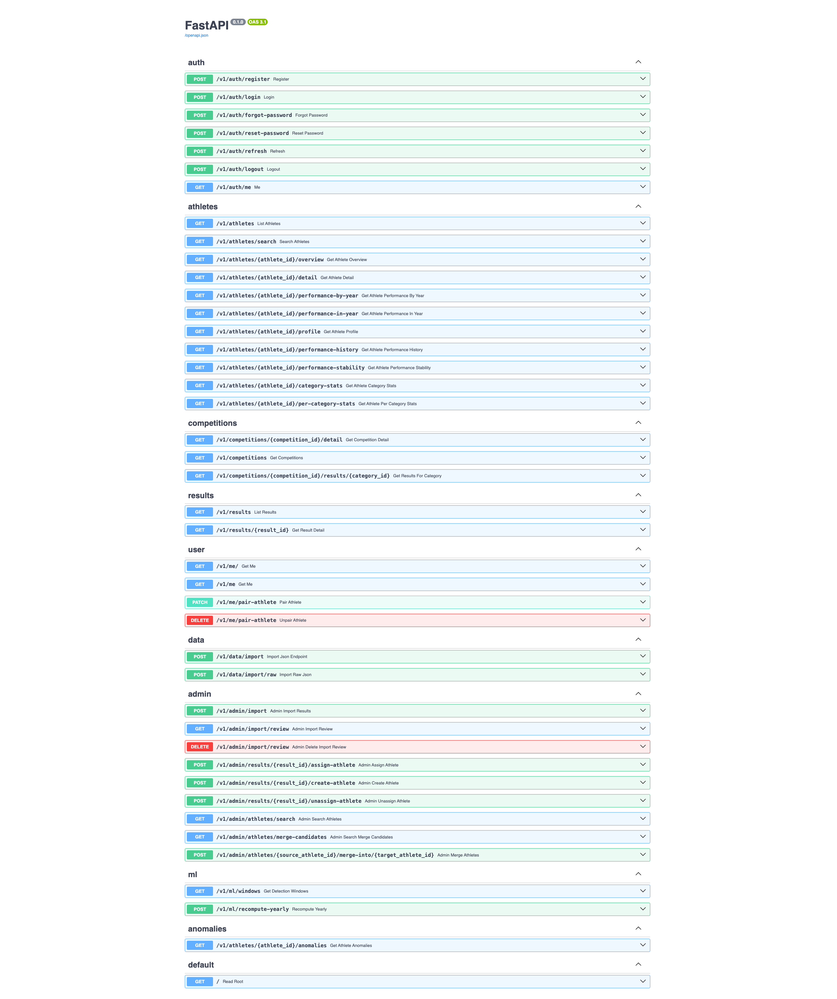

# Firesport App

Webová aplikace pro prohlížení, správu a analýzu výsledků v požárním sportu. Projekt kombinuje FastAPI backend, React frontend a MongoDB databázi.

## Co aplikace aktuálně umí

- evidenci soutěží, kategorií, závodníků a výsledků importovaných z JSON souborů,
- stránkovaný seznam závodníků a soutěží včetně vyhledávání a řazení,
- detail závodníka s přehledem identit, kategorií, výsledků a základních statistik,
- uživatelskou domovskou stránku po spárování se závodníkem, včetně přehledu sezóny, trendu výkonu a stability výkonu,
- detail závodu a výsledky jednotlivých kategorií,
- registraci, přihlášení a propojení uživatele se závodníkem,
- administraci importu, ruční kontrolu problematických záznamů, ruční přiřazení výsledků a slučování duplicitních závodníků,
- analytiku neobvyklých výkonů nad vybraným obdobím pomocí Isolation Forest.

## Architektura

### Backend

Backend je postavený na **FastAPI** a poskytuje REST API pro autentizaci, uživatelský profil, závodníky, soutěže, výsledky, import dat, administraci a analytické endpointy pro detekci anomálií. Data jsou ukládána do **MongoDB**, backend používá knihovny **Motor/PyMongo** a pro analytiku **scikit-learn**.

### Frontend

Frontend je vytvořený v **Reactu 18**. Používá **React Router**, **TanStack Query**, **Axios**, **Recharts** a **Sass**. Obsahuje veřejné stránky pro přihlášení a registraci i přihlášenou část aplikace s přehledem závodníků, závodů, statistik a administrace.

### Databáze

Data jsou uložená v **MongoDB**. Při spuštění přes Docker Compose backend podle aktuální konfigurace automaticky načte JSON soubory ze složky [`data`](/firesport-app/data) a provede import databáze. Importovací skript při startu maže existující kolekce s výsledky, soutěžemi, závodníky, kategoriemi a daty anomálií, aby byl start konzistentní.

## Spuštění

Nejjednodušší způsob je přes Docker Compose:

```bash
docker compose up --build
```

Po spuštění bude dostupné:

- frontend: [http://localhost:3000](http://localhost:3000)
- backend API: [http://localhost:8000](http://localhost:8000)
- Swagger dokumentace: [http://localhost:8000/docs](http://localhost:8000/docs)

Aktuální `docker-compose.yml` spouští tři služby:

- `frontend` - React development server
- `backend` - FastAPI aplikaci s volitelným debug portem `5679`
- `mongo` - MongoDB databázi

Backend při startu čeká na MongoDB a následně automaticky spouští import dat ze složky `data/`.

## Struktura projektu

- [`backend`](/backend/) - FastAPI aplikace, API routery, služby, modely, databázová vrstva a skripty pro import dat
- [`frontend`](/frontend) - React aplikace, stránky, komponenty, hooky a styly
- [`data`](/data) - zdrojová JSON data pro seed a import výsledků
- [`docs/screenshots`](/docs/screenshots) - screenshoty aplikace

## Screenshoty

### Úvodní strana

Domovská stránka zobrazuje přehled spárovaného závodníka, aktuální sezónu a základní ukazatele výkonu. Slouží jako hlavní rozcestník do uživatelské části aplikace.


### Závodníci

Stránka zobrazuje seznam závodníků s možností vyhledávání a postupného procházení dat. Umožňuje rychlý přechod na detail konkrétního profilu.



### Detail závodníka

Detail závodníka shrnuje základní identitu, kategorie, výsledky a hlavní statistiky. U administrátora navíc slouží i pro kontrolu a případné sloučení duplicitních profilů.



### Závody

Na stránce je seznam soutěží s vyhledáváním a řazením podle základních údajů. Uživatel odtud pokračuje na detail konkrétního závodu.



### Detail závodu

Detail závodu zobrazuje základní informace o soutěži a dostupné kategorie. Z této stránky je možné otevřít výsledkové listiny jednotlivých kategorií.



### Výsledky

Výsledková listina ukazuje pořadí, časy, pokusy a základní údaje o závodnících v dané kategorii. Pokud je závodník spárovaný, lze se z výsledku prokliknout přímo na jeho profil.



### Statistiky

Statistická stránka slouží k přehledu neobvyklých výkonů v čase a zobrazuje výstupy detekce anomálií. Součástí je i kontext analyzovaného období a doplňující informace k modelu.


### Administrace importu

Administrace importu umožňuje nahrát nové JSON soubory s výsledky a zkontrolovat problematické záznamy po importu. Administrátor zde může výsledky ručně přiřadit, odpárovat nebo vytvořit nového závodníka.


### API

Swagger dokumentace zpřístupňuje všechny aktuální backendové endpointy.


