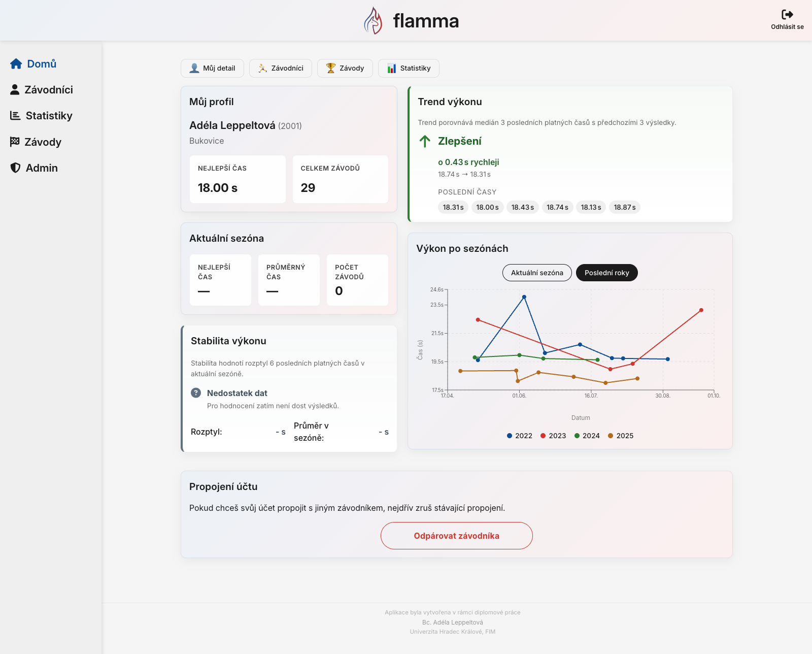
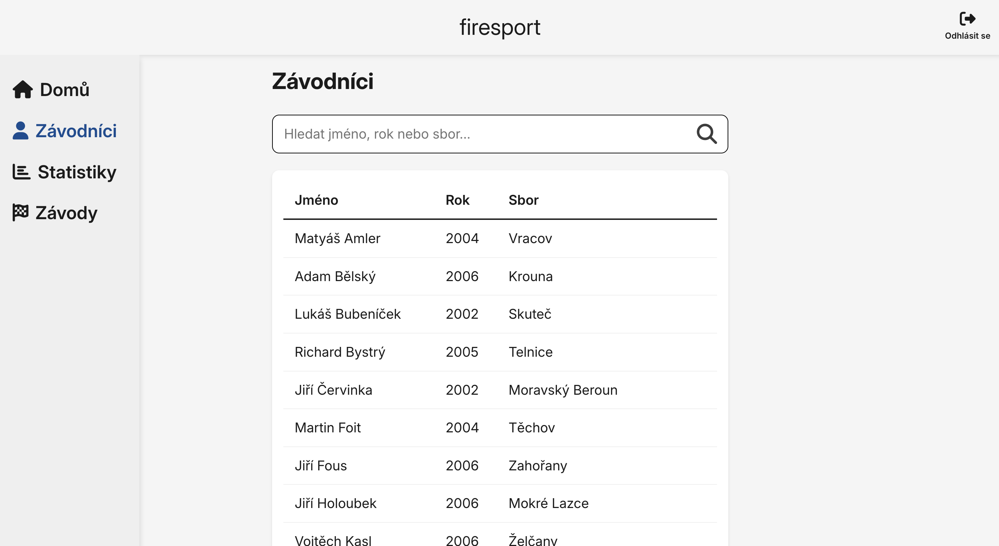
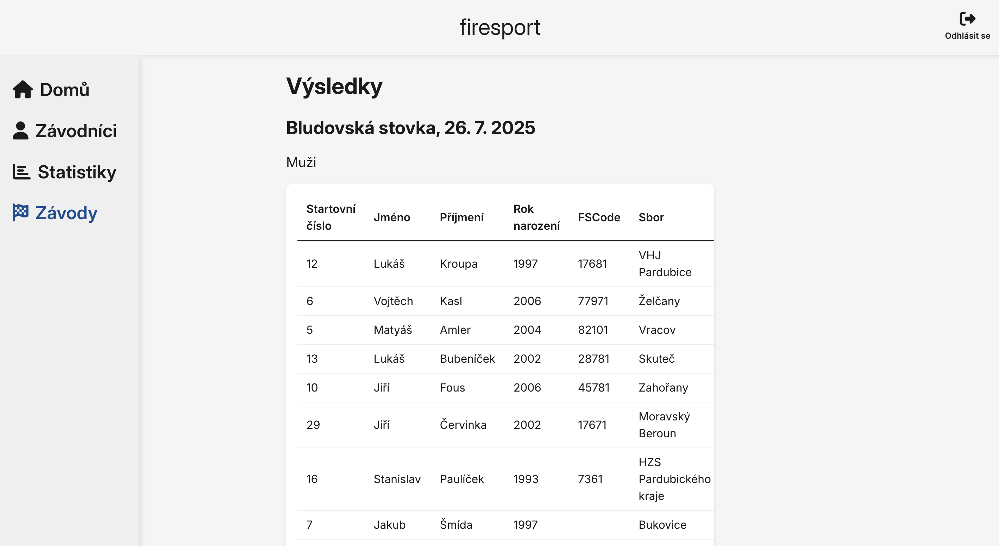
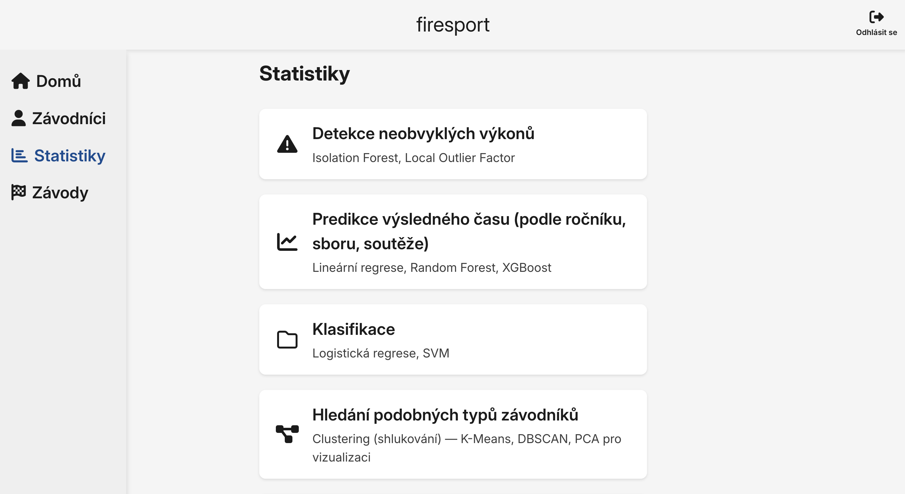
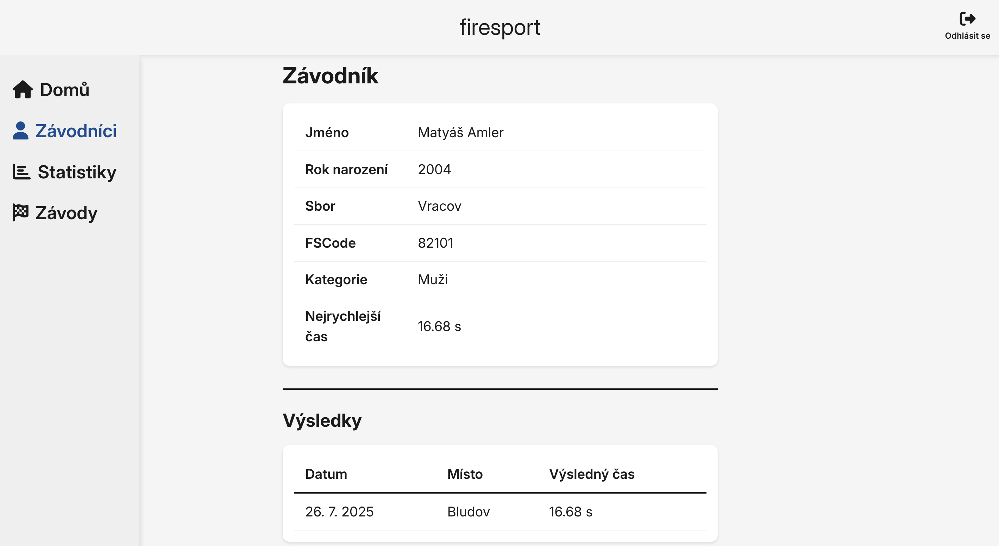
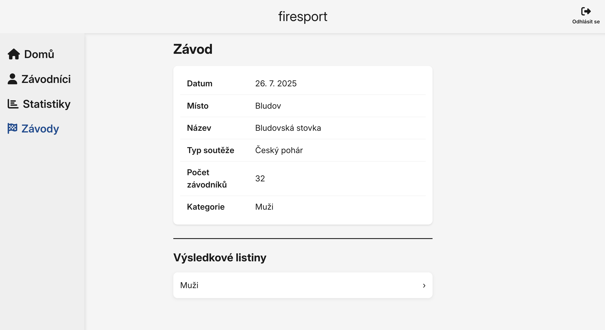
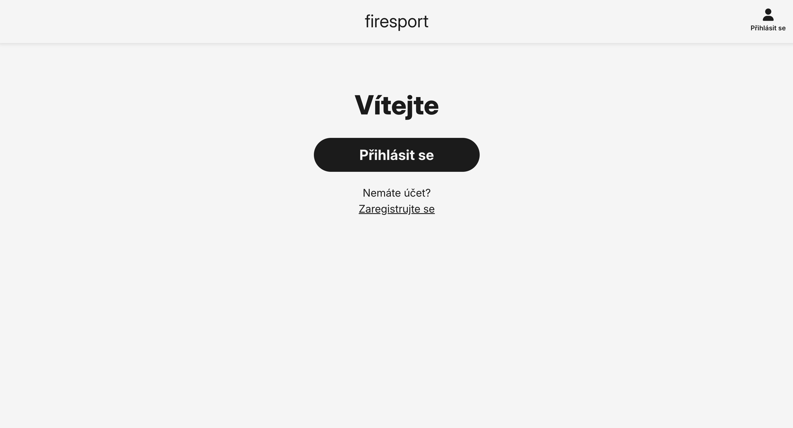
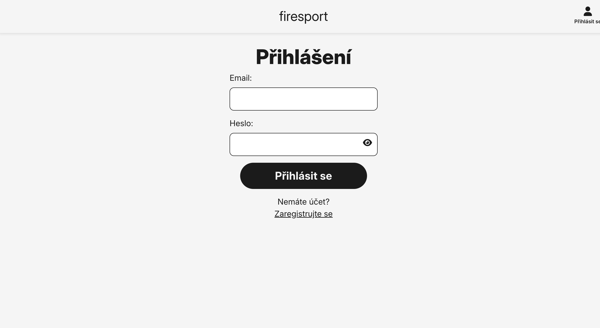
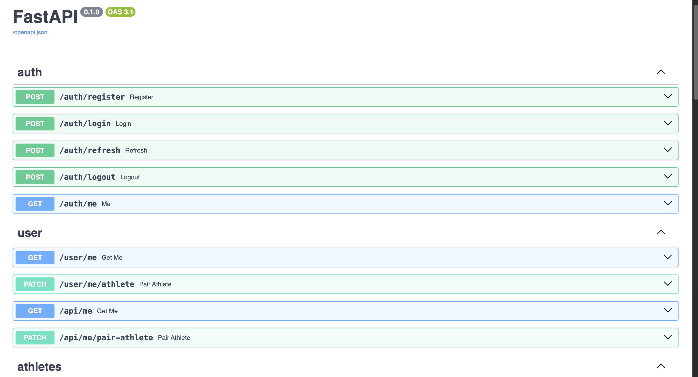
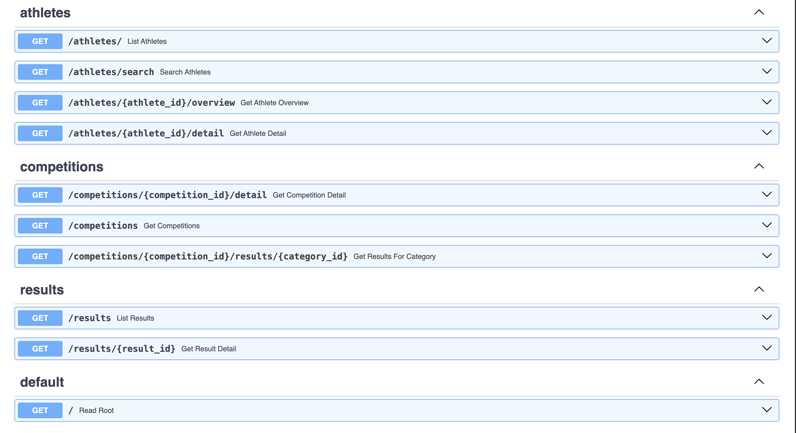

# Aplikace pro analýzu dat

## Popis

Praktická část diplomové práce – webová aplikace pro správu a analýzu výkonu atletů v požárním sportu.

## Architektura

### Backend

Implementován v jazyce Python s využitím frameworku FastAPI.
Poskytuje REST API pro práci se sportovními daty.

Obsahuje:

- API endpointy pro práci s daty (např. sportovci, soutěže, výsledky),
- datové modely a validační schémata,
- logiku komunikace s databází MongoDB,
- základní strukturu připravenou pro rozšíření o analytické metody.

Backend v současné fázi plní funkci stabilní datové a aplikační vrstvy, na kterou budou navázány metody strojového učení.

### Databáze

Použita dokumentová databáze MongoDB.

Datový model je navržen s ohledem na strukturu sportovních výsledků, kategorií, soutěží a sportovců.
Databáze je v samostatném kontejneru a je přístupná přes backendovou vrstvu.

### Frontend

Implementován jako aplikace v React.

Využívá:

- React Router pro navigaci mezi stránkami,
- TanStack Query pro práci s asynchronními daty,
- Axios pro komunikaci s backendovým API.
- Frontend slouží jako prezentační vrstva aplikace a umožňuje ověřování funkčnosti API.

Aktuálně je:

- implementována základní struktura aplikace,
- funkční napojení na backend,
- rozpracovaná hlavní obrazovka aplikace.

## Spuštění

Projekt je možné spustit lokálně pomocí Docker Compose (docker compose build, docker compose up).
Po spuštění je k dispozici:

- backend na adrese http://localhost:8000,
- frontend na adrese http://localhost:3000.

## Aktuální stav

V současnosti aplikace umožňuje:

- spuštění backendové a frontendové části v lokálním vývojovém prostředí,
- komunikaci mezi frontendem, backendem a databází,
- uživatelské rozhraní.

V současné fázi je pro metody strojového učení připravena souborová a projektová struktura, samotné modely však zatím nejsou implementovány.

## Plánováno / Rozpracováno

- finální návrh a implementace hlavní stránky (HomePage),
- implementace metod strojového učení,
- vizualizace analytických výstupů ve frontendové části,
- vyhodnocení a interpretace výsledků modelů.

## Náhled aktuálního stavu aplikace

Následující screenshoty dokumentují aktuální stav vývoje aplikace.

### HomePage

Základní stránka aplikace. Finální podoba a obsah této stránky budou dopracovány.

### Práce se sportovními daty

Ukázka seznamu sportovců, soutěží a výsledků. A ukázka stránky, kde budou implementovány metody strojového učení.

### Detail záznamu

Detailní pohled na vybraný záznam - sportovec a soutěž.

### Uvítací stránka a login

### Backend API

Automaticky generovaná dokumentace REST API pomocí FastAPI (Swagger UI).

