# Flamma

Projekt vznikl jako praktická část diplomové práce „Analýza sportovních dat metodami strojového učení“.

Flamma je webová aplikace pro evidenci, prohlížení a základní analytické vyhodnocení historických výsledků v požárním sportu, konkrétně v disciplíně běh na 100 m s překážkami. Aplikace propojuje databázové uložení výsledků, prezentaci sportovní historie závodníků a analytickou vrstvu pro detekci neobvyklých výkonů.

## Vztah k diplomové práci

Repozitář slouží jako příloha diplomové práce. Praktická část navazuje na datovou přípravu výsledků, jejich uložení do strukturované podoby a následné zpracování v prostředí webové aplikace. Vedle evidenční a prezentační funkce obsahuje také implementaci detekce neobvyklých výkonů pomocí modelu Isolation Forest.

## Hlavní funkce

- evidence soutěží, kategorií, závodníků a jednotlivých výsledků,
- seznam závodníků a soutěží s vyhledáváním, stránkováním a řazením,
- detail závodníka s historií výkonů, přehledem kategorií a základními ukazateli,
- zobrazení analytických výstupů pro neobvyklé výkony,
- registraci, přihlášení, obnovu hesla a spárování uživatelského účtu se závodníkem,
- import strukturovaných JSON souborů s výsledky,
- uživatelská domovská stránka po spárování účtu se závodníkem,
- administrace importu a ruční kontrola problematických záznamů,
- REST API se Swagger dokumentací na `/docs`.

## Technologie

- backend: FastAPI, Motor, PyMongo, NumPy, scikit-learn, python-jose, argon2-cffi,
- frontend: React 18, React Router, TanStack Query, Axios, Recharts, Sass,
- databáze: MongoDB,
- provozní prostředí: Docker Compose,
- lokální e-mailové testování: Mailpit.

## Architektura

Projekt je rozdělen na frontend, backend, databázi a datovou složku.

- Frontend v Reactu zajišťuje veřejné stránky, přihlášenou část aplikace i administrační rozhraní.
- Backend ve FastAPI poskytuje REST API pro autentizaci, práci se závodníky, soutěžemi, výsledky, importem dat a analytickými výstupy.
- Data jsou ukládána do MongoDB.
- Docker Compose v aktuální konfiguraci spouští služby `frontend`, `backend`, `mongo` a `mailpit`.

Hlavní skupiny endpointů:

- `/v1/auth` a `/v1/me` pro registraci, přihlášení, správu relace a spárování uživatele se závodníkem,
- `/v1/athletes` pro seznamy, detail závodníka a související přehledy výkonu,
- `/v1/competitions` a `/v1/results` pro soutěže a výsledkové listiny,
- `/v1/data` a `/v1/admin` pro import a administrativní práci s daty,
- `/v1/ml` a `/v1/athletes/{id}/anomalies` pro analytickou vrstvu.

## Datový základ a import

Aplikace pracuje se strukturovanými JSON soubory vytvořenými ze zdrojových výsledkových listin. Ve složce [`data`](data) jsou data uspořádána podle roku a soutěže, typicky ve tvaru `data/<rok>/<soutez>/*.json`.

Import podporuje tyto cesty:

- nahrání JSON souboru přes administraci v aplikaci,
- API endpointy `/v1/data/import`, `/v1/data/import/raw` a `/v1/admin/import`,
- volitelný seed při startu backendu skriptem [`backend/scripts/load_data.py`](backend/scripts/load_data.py), který je spuštěn pouze při nastavení `IMPORT_DATA=true`.

V aktuálním souboru [`docker-compose.yml`](docker-compose.yml) je `IMPORT_DATA=false`. Po běžném spuštění `docker compose up --build` se tedy data automaticky nenačítají. Automatický seed je podmíněný a neslouží jako výchozí chování.

Při seed importu při startu backendu se pro čistý začátek mažou kolekce `results`, `competitions`, `athletes`, `categories`, `anomaly_runs` a `anomaly_scores`.

## Detekce neobvyklých výkonů

Detekce neobvyklých výkonů je implementována v backendu pomocí modelu Isolation Forest z knihovny scikit-learn.

- vstupní proměnnou je finální čas `final_time`,
- do výpočtu vstupují pouze výsledky označené jako validní (`final_time_status="valid"`) a s vyplněným finálním časem,
- výpočet probíhá nad uloženými časovými okny typu `yearly_3y`, tedy nad tříletými ročními okny,
- výsledkem je skóre a označení neobvyklých výkonů pro závodníka v daném období.

Označení neobvyklého výkonu neznamená automaticky chybu v datech. Může jít o mimořádně rychlý nebo naopak výrazně slabší výkon, který se odlišuje od ostatních validních výsledků v analyzovaném souboru.

## Spuštění projektu

Nejjednodušší způsob spuštění je přes Docker Compose:

```bash
docker compose up --build
```

Po spuštění jsou dostupné tyto služby:

- frontend: [http://localhost:3000](http://localhost:3000)
- backend API: [http://localhost:8000](http://localhost:8000)
- Swagger dokumentace: [http://localhost:8000/docs](http://localhost:8000/docs)
- Mailpit: [http://localhost:8025](http://localhost:8025)

Frontend běží jako vývojový server Reactu. Backend startuje přes [`backend/entrypoint.sh`](backend/entrypoint.sh), nejprve čeká na MongoDB a teprve poté případně spouští seed import dat podle hodnoty `IMPORT_DATA`.

## Struktura projektu

- [`backend`](backend) - FastAPI aplikace, API routery, služby, modely, databázová vrstva a analytická logika,
- [`frontend`](frontend) - React aplikace, stránky, komponenty, hooky a styly,
- [`data`](data) - strukturovaná vstupní data ve formátu JSON,
- [`docs/screenshots`](docs/screenshots) - obrazové ukázky aplikace,
- [`docs/notebooks`](docs/notebooks) - doprovodné analytické materiály.

## Ukázky aplikace

### Uvítací obrazovka

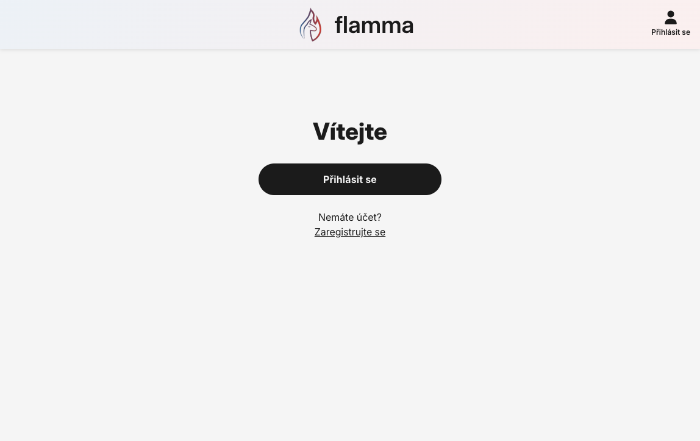

### Domovská stránka


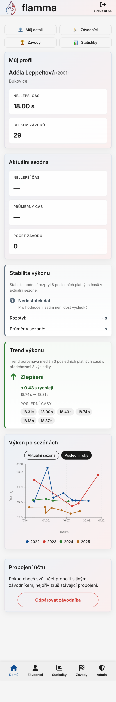

### Seznam závodníků

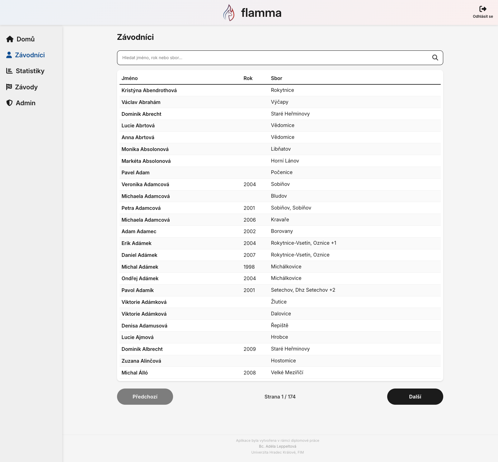

### Detail závodníka

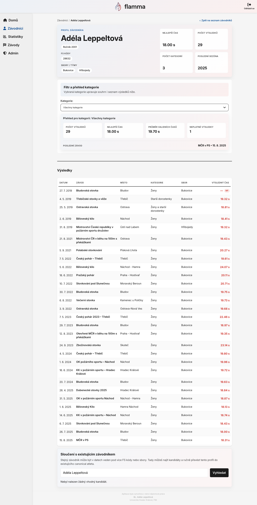

### Seznam soutěží

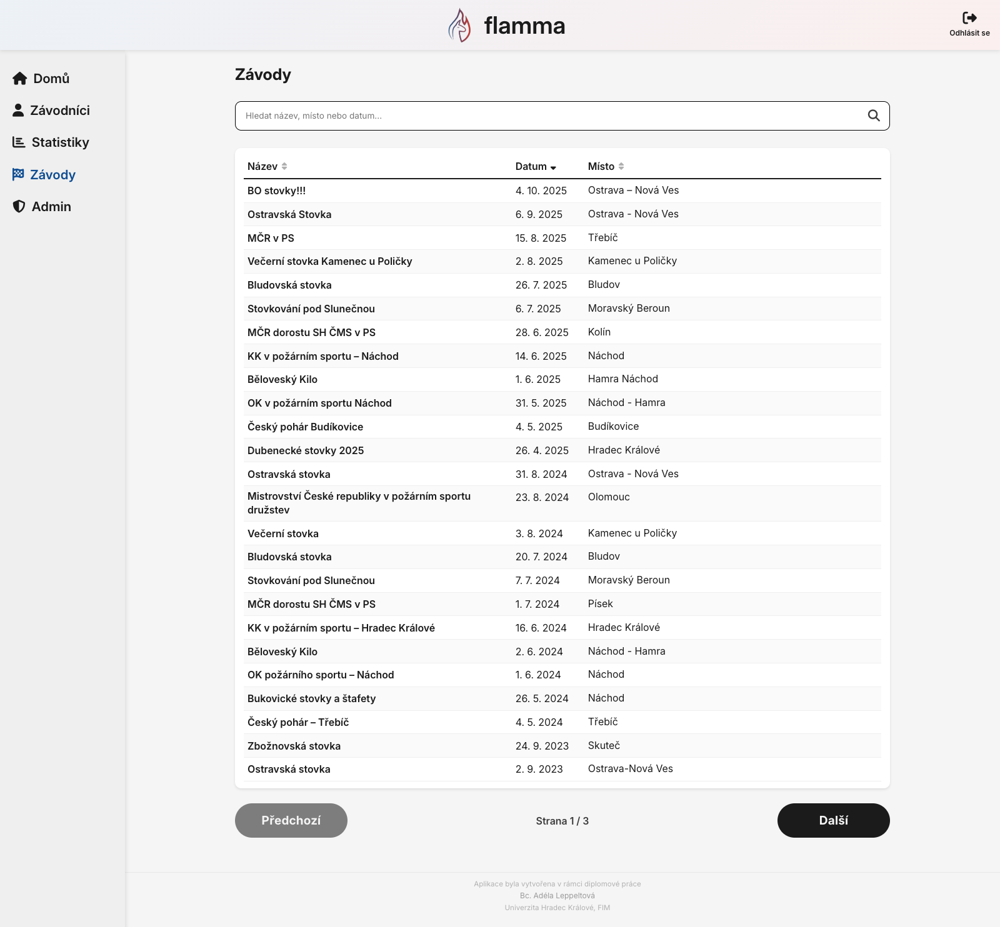

### Detail soutěže

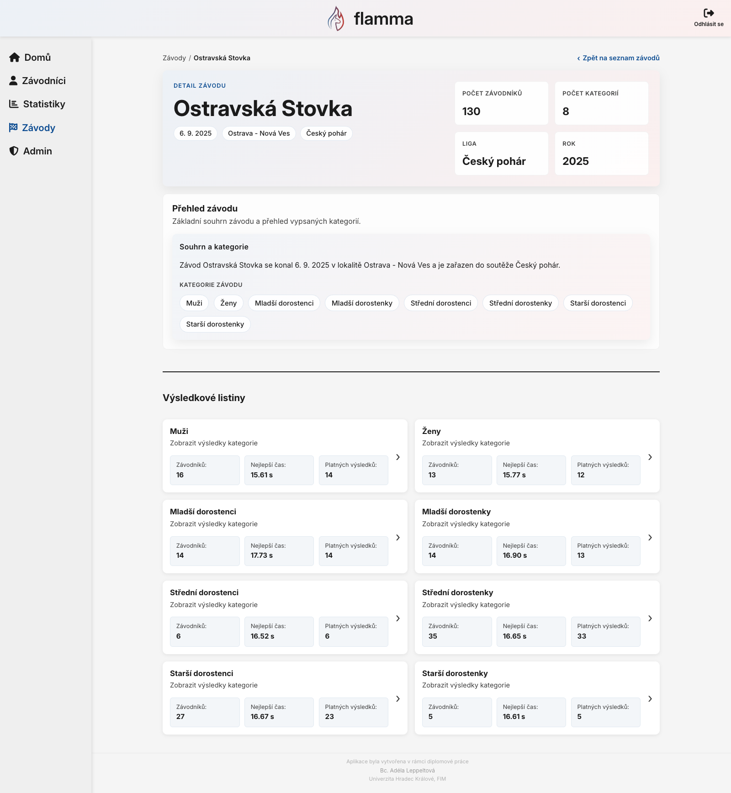

### Výsledková listina

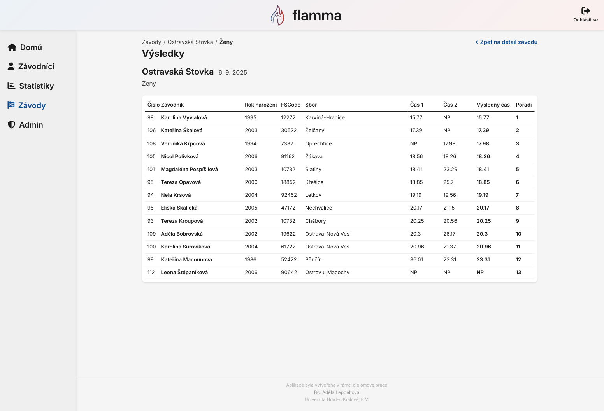

### Statistiky a neobvyklé výkony

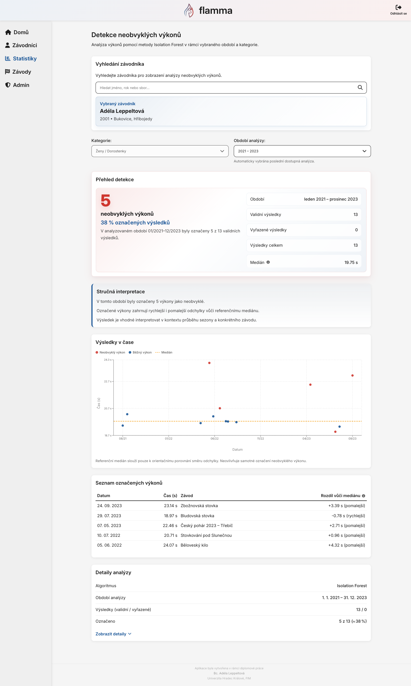
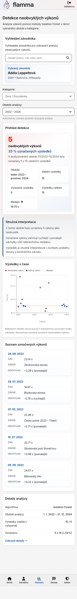

### Administrace importu

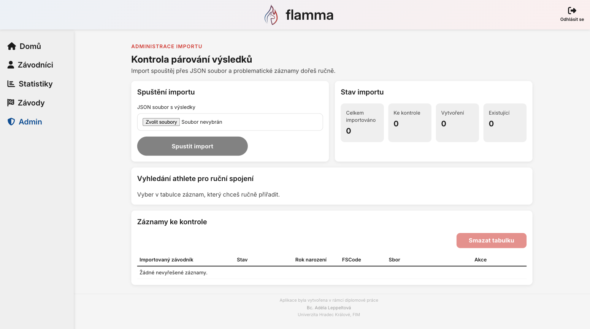

### Přihlášení a registrace

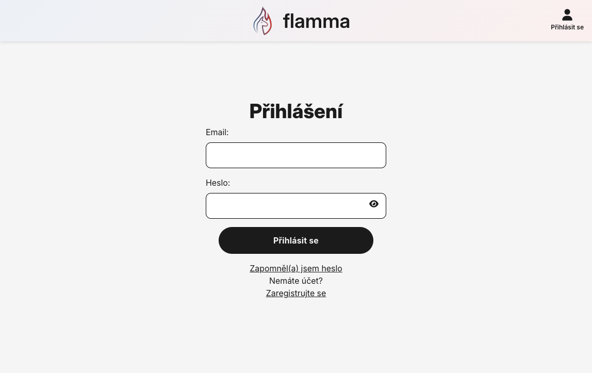
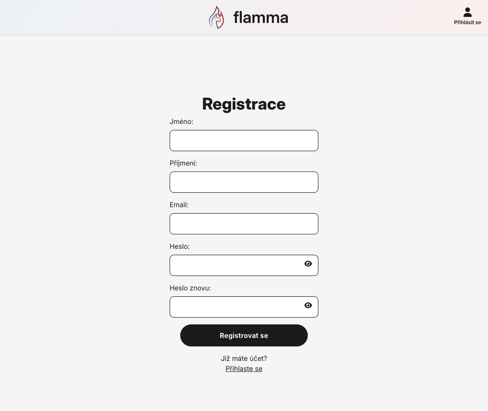

### API dokumentace


## Poznámka k využití dat a interpretaci výstupů

Použitá data vycházejí ze zdrojových výsledkových listin a byla převedena do strukturovaných JSON souborů pro potřeby evidence a analytického zpracování. Aplikace je určena především pro dokumentaci výsledků, prezentaci sportovní historie závodníků a podporu analytické interpretace.

Analytické výstupy je vhodné chápat jako podpůrnou informaci, nikoli jako automatický důkaz chyby nebo mimořádnosti bez dalšího kontextu. Význam výsledků závisí také na úplnosti importovaných dat, kvalitě párování závodníků a rozsahu dostupné historie výkonů.
